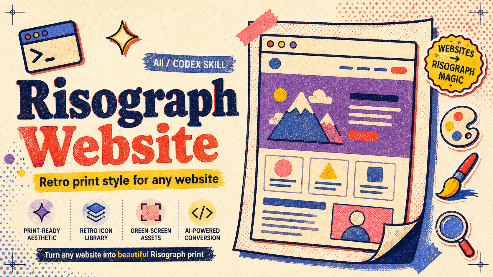

<p align="center">
  
</p>

# Risograph Website

把任何网站、Web App、Landing Page、Dashboard 或 UI 原型包装成现代 **Risograph 复古印刷风** 的 Codex Skill。

It is a Codex skill for transforming websites, web apps, landing pages, dashboards, and UI prototypes into a modern **retro Risograph print** style.

---

## 中文

`risograph-website` 不是一个简单的“换皮提示词”。它是一套给 Agent 使用的风格工程资产：视觉系统、转换提示词、图标库、绿幕展示图流程、语义选图脚本和验证清单。

目标是让网站有暖纸底、粗墨线、有限专色、轻微错版、网点颗粒和独立印刷品的手工质感，同时保留原网站的信息架构、产品逻辑、可访问性和核心交互。

### 适合用在

- Landing Page、产品官网、作品集、课程页
- SaaS 工具、编辑器、控制台、Dashboard
- 表单、结账页、空状态、Onboarding
- App Store / 公众号 / 社交媒体用的网站展示图
- 需要绿幕生成后抠成透明 PNG 的展示资产

### 包含什么

```text
risograph-website/
├── SKILL.md
├── agents/openai.yaml
├── references/
│   ├── visual-system.md
│   ├── transformation-prompt.md
│   ├── icon-usage.md
│   ├── showcase-cutout.md
│   └── website-patterns.md
├── scripts/
│   ├── select_icons.py
│   ├── copy_icons.py
│   └── build_icon_manifest.py
└── assets/
    ├── risograph-website-header.png
    └── risograph-icons-160/
        ├── icons/                 # 160 个透明 PNG 图标
        ├── sheets/                # 10 张 4x4 绿幕源图
        ├── prompts/sheet-prompts.md
        └── wiki/icon-wiki.tsv
```

### 风格关键词

- 暖纸底和深墨文字
- Risograph 专色：朱红、暖黄、蓝、靛蓝、紫、粉
- 粗线描边、错版套色、低透明网点
- 印章标签、裁切标记、海报式分区
- 透明 PNG 图标贴纸
- 绿幕展示图和透明抠像资产

### 安装

把仓库放到 Codex Skills 目录下：

```bash
cd ~/.codex/skills
git clone https://github.com/qybaihe/risograph-website.git
```

之后在 Codex 中可以直接说：

```text
用 risograph-website 把这个网站改成现代 Risograph 复古印刷风，图标从内置库里挑，保持功能不变。
```

### 最小使用示例

按语义找图标：

```bash
python scripts/select_icons.py --query "dashboard analytics search" --limit 8
```

复制图标到目标项目：

```bash
python scripts/copy_icons.py \
  --slugs search chart-up settings-gear \
  --out ./public/risograph-icons \
  --manifest
```

生成图标 manifest：

```bash
python scripts/build_icon_manifest.py
```

### 绿幕展示图

`references/showcase-cutout.md` 定义了一个稳定流程：先把网站截图包装成 Risograph 风格的绿幕展示图，再用 chroma-key 抠成透明 PNG。

这适合做：

- 官网 Hero 展示物
- 公众号封面和配图
- App Store 截图素材
- PPT / Pitch Deck 视觉资产
- 社交媒体宣传图

核心原则是：背景必须是纯 `#00ff00`，主体不能使用绿色，边缘要留足 padding，抠像后检查四角透明和绿色溢边。

### 使用边界

请避免：

- 把页面做成旧羊皮纸或复古脏污风
- 在正文、小字、输入框、表格里铺满纹理
- 用低对比文字压在专色块上
- 用装饰挡住按钮、导航或产品截图
- 把 Dashboard 变成海报，牺牲扫描效率

好的 Risograph 网站应该像一张能工作的印刷品：有触感，但不妨碍任务完成。

---

## English

`risograph-website` is not just a prompt. It is a style system for agents: visual rules, transformation guidance, bundled icons, green-screen showcase workflow, semantic icon scripts, and verification checks.

Its goal is to give a website the tactile charm of retro Risograph print: warm paper surfaces, chunky ink outlines, limited spot colors, slight misregistration, halftone grain, and zine/poster energy, while preserving the original product logic, information architecture, accessibility, and interactions.

### Best for

- Landing pages, product sites, portfolios, course pages
- SaaS tools, editors, consoles, dashboards
- Forms, checkout flows, empty states, onboarding
- Website showcase images for app stores, newsletters, social media, or decks
- Green-screen mockups that should become transparent PNG assets

### What's included

```text
risograph-website/
├── SKILL.md
├── agents/openai.yaml
├── references/
│   ├── visual-system.md
│   ├── transformation-prompt.md
│   ├── icon-usage.md
│   ├── showcase-cutout.md
│   └── website-patterns.md
├── scripts/
│   ├── select_icons.py
│   ├── copy_icons.py
│   └── build_icon_manifest.py
└── assets/
    ├── risograph-website-header.png
    └── risograph-icons-160/
        ├── icons/                 # 160 transparent PNG icons
        ├── sheets/                # 10 green-screen 4x4 source sheets
        ├── prompts/sheet-prompts.md
        └── wiki/icon-wiki.tsv
```

### Style anchors

- Warm paper backgrounds and dark ink text
- Risograph spot colors: vermilion, yellow, blue, indigo, violet, pink
- Chunky outlines, offset registration, low-opacity halftone fields
- Stamp labels, crop marks, poster-like bands
- Transparent PNG sticker icons
- Green-screen showcase mockups and transparent cutouts

### Install

Clone this repo into your Codex Skills directory:

```bash
cd ~/.codex/skills
git clone https://github.com/qybaihe/risograph-website.git
```

Then ask Codex:

```text
Use risograph-website to transform this website into a modern retro Risograph print style. Pick icons from the bundled library and preserve the existing functionality.
```

### Quick usage

Search for icons semantically:

```bash
python scripts/select_icons.py --query "dashboard analytics search" --limit 8
```

Copy selected icons into a target website:

```bash
python scripts/copy_icons.py \
  --slugs search chart-up settings-gear \
  --out ./public/risograph-icons \
  --manifest
```

Build the icon manifest:

```bash
python scripts/build_icon_manifest.py
```

### Green-screen showcase cutouts

`references/showcase-cutout.md` defines a repeatable workflow: package a website screenshot as a Risograph-styled green-screen showcase image, then remove the chroma-key background into a transparent PNG.

This is useful for:

- Website hero visuals
- Newsletter or WeChat article images
- App Store screenshots
- Pitch decks and presentations
- Social media launch graphics

The key rule: keep the background pure `#00ff00`, never use green inside the subject, leave generous padding, and validate transparent corners after removal.

### Guardrails

Avoid:

- Old parchment or dirty vintage paper effects
- Texture behind body text, inputs, or table data
- Low-contrast text on spot-color fields
- Decorations covering buttons, navigation, or screenshots
- Turning dashboards into posters at the cost of scanability

A good Risograph website should feel like printed software: tactile, memorable, and still easy to use.

## License

MIT. See [LICENSE](LICENSE).
